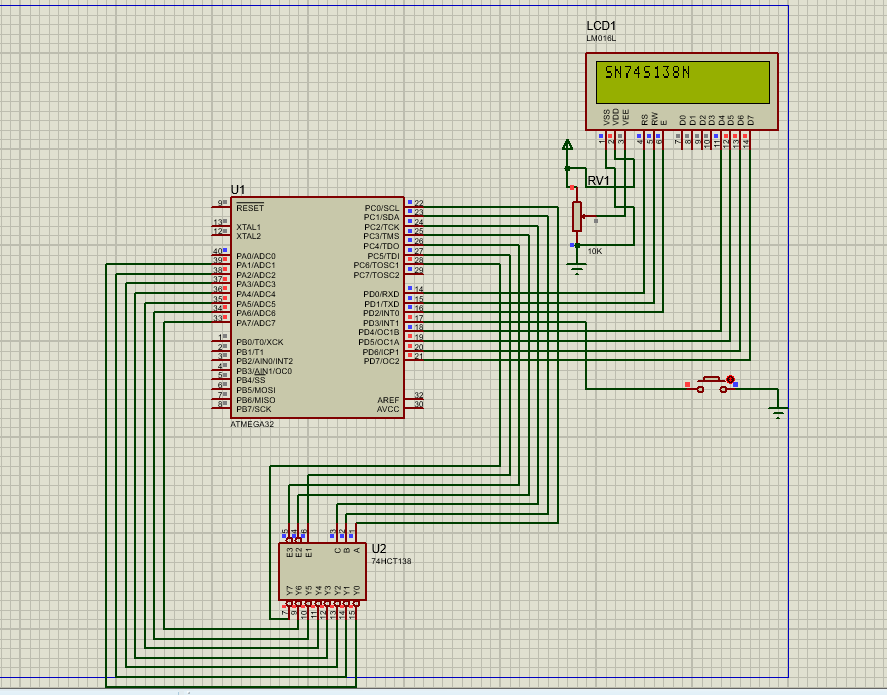

# ATmega32 IC Tester
This project implements an IC tester using the ATmega32 microcontroller, designed to test integrated circuits (ICs) like the SN74S138N, SN74260, and SN74S133. The program uses the internal 1 MHz clock of the ATmega32 and displays the test results on a 16x2 LCD. The code can easily be modified to test other ICs by adjusting the input/output logic.

# Features
Tests SN74S138N, SN74260, and SN74S133 ICs.
Can be easily modified to support testing other ICs with necessary input/output logic adjustments.
Uses internal 1 MHz clock of ATmega32.
Displays results on a 16x2 LCD screen.
Debounced button press for triggering tests.
Requirements
ATmega32 microcontroller.
16x2 LCD display.
External push button for triggering tests.
Proper wiring for the ICs under test.
# How to Use
Connect the ATmega32 to your ICs (SN74S138N, SN74260, or SN74S133).
Set up the 16x2 LCD for displaying results.
Press the button to start the IC test.

The LCD will display the detected IC or "NO MATCH" if no IC is detected.
To test other ICs, modify the input/output logic in the code to match the new IC’s specifications.

# Code Modifications
To test other ICs, you can modify the following sections in the code:

Input/Output Pin Configuration: Adjust port settings for the new IC.
Test Logic: Update the input/output logic for the IC’s pin behavior.
